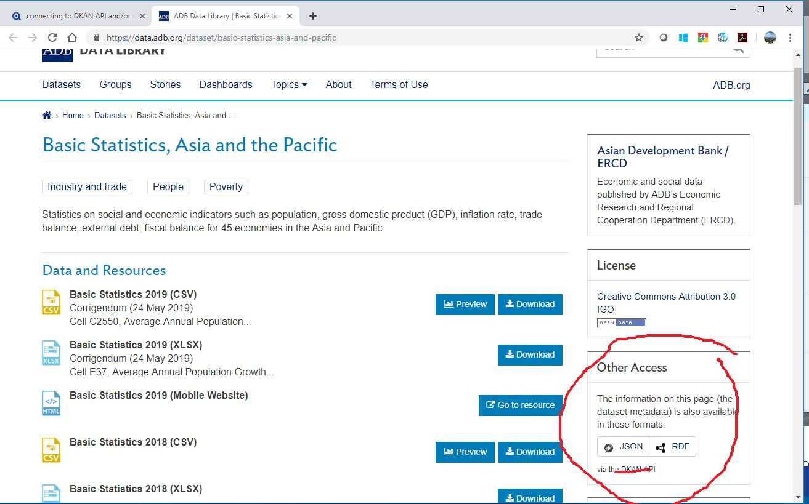

# capturing structured data from APIs

A website often presents information twice: as a page designed for a person and as a machine-readable response designed for software. When a documented API, feed, or bulk download represents the information we need, capturing it directly is usually clearer and more reproducible than scraping the rendered page.

Part of [data capture](README.md), this page considers the response and its retrieval context as one evidence package.

## a historical example



*This 2019 screenshot records an ADB Data Library page that exposed dataset metadata as JSON and RDF through a DKAN API. The interface is historical; the durable point is that a data catalog may offer a more precise machine-readable source behind its web page.*

[DKAN](https://dkan.readthedocs.io/en/4.x/) continues to document an API-oriented open data catalog. A current capture should use the documentation and endpoints belonging to the particular deployment rather than assuming that an older DKAN path or response shape still applies.

## formats do different work

- [JSON](https://datatracker.ietf.org/doc/html/rfc8259) is a widely used syntax for structured values, arrays, and objects. An API's schema gives those values their project-specific meaning.
- [RDF](https://www.w3.org/TR/rdf11-primer/) represents statements as a graph of identified resources and relationships. RDF can be serialized in several formats, so an `RDF` link alone does not tell us the exact response syntax.
- CSV, XML, GeoJSON, JSON-LD, and other formats may expose the same conceptual record with different levels of structure, typing, and linkage.

Choosing a format is not only a matter of convenience. Preserve the representation most faithful to the source and record the media type, schema, profile, or vocabulary needed to interpret it.

## capturing one response

A simple capture can retain the payload and response headers separately:

```sh
curl \
  --fail-with-body \
  --location \
  --retry 3 \
  --header "Accept: application/json" \
  --dump-header "response-headers.txt" \
  --output "response.json" \
  "https://api.example.org/v1/datasets/example"
```

The capture record should also store the retrieval time, request URL and query parameters, non-secret request headers, API version, tool version, response status, checksum, and applicable license. Authentication tokens must be omitted or redacted from commands and logs.

## complete collections

Many APIs return one page of results at a time. Before calling a capture complete, account for:

- page numbers, cursors, continuation tokens, or `next` links;
- server-side limits and rate-limit headers;
- sorting, filters, and default date windows;
- records that change while pagination is underway;
- deleted or superseded records;
- related endpoints needed to interpret identifiers; and
- schema or API-version changes.

For a changing collection, record a consistent cutoff or snapshot mechanism if the API provides one. Otherwise, state that the capture reflects a retrieval interval rather than one atomic moment.

## schema, license, and provenance

A valid JSON response can still be misunderstood. Preserve or link to the data dictionary, schema, vocabulary, units, code lists, and API documentation used at capture time. Record whether the payload contains source data, calculated fields, a catalog description, or merely links to downloadable resources.

The ability to retrieve a response does not settle the right to republish it. Preserve dataset-level licenses and attribution separately from the API software's license. Review personal, confidential, and location information before moving a captured response into analysis or publication.

## validation

Parse the response with an appropriate validator, but also check meaning: expected record count, required identifiers, date range, units, null values, duplicate records, and relationships to downloaded files. Keep the unmodified response as the raw capture and write normalized or combined data to a derived layer.
